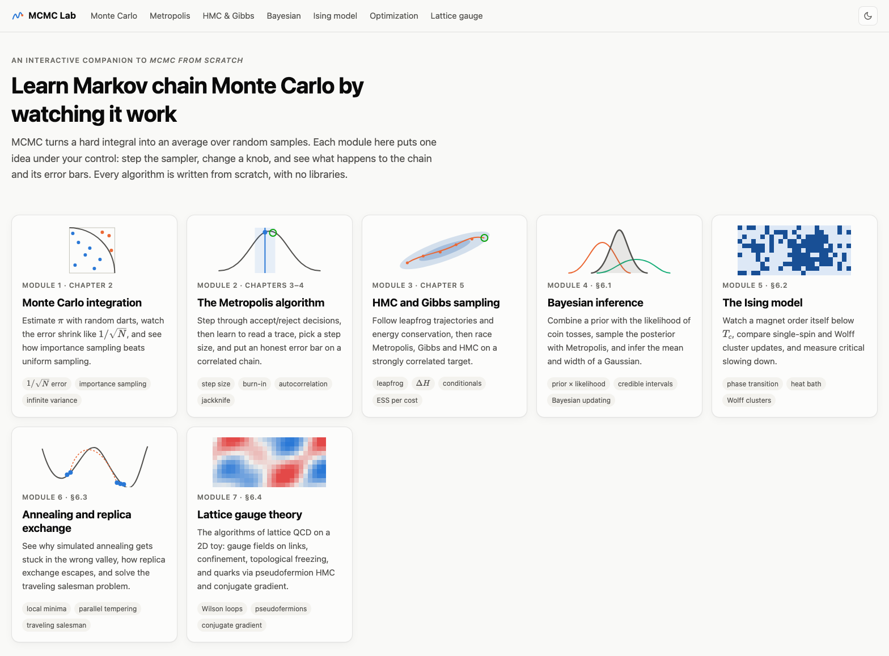
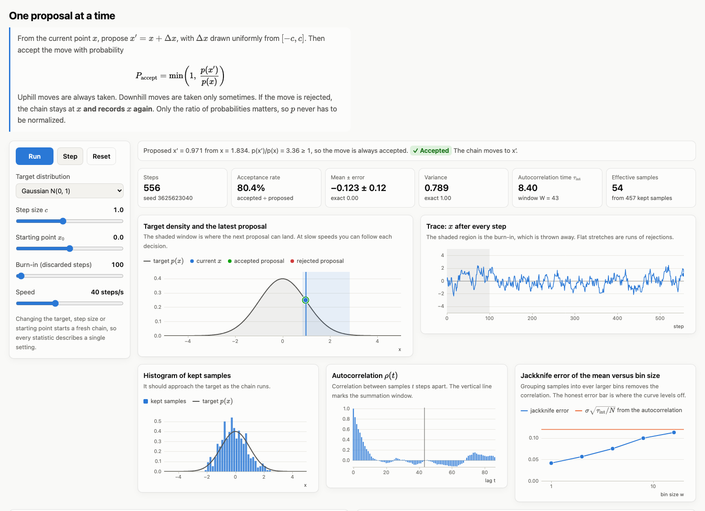
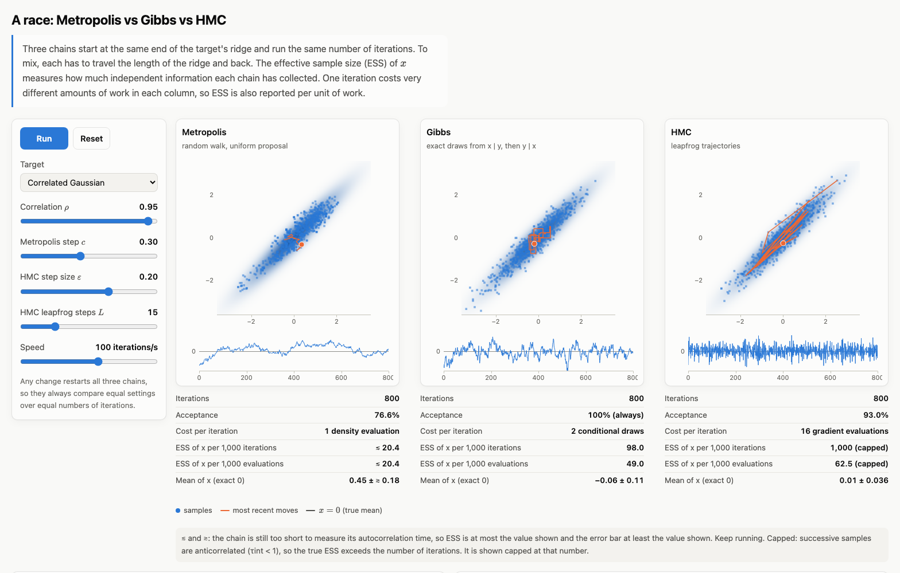
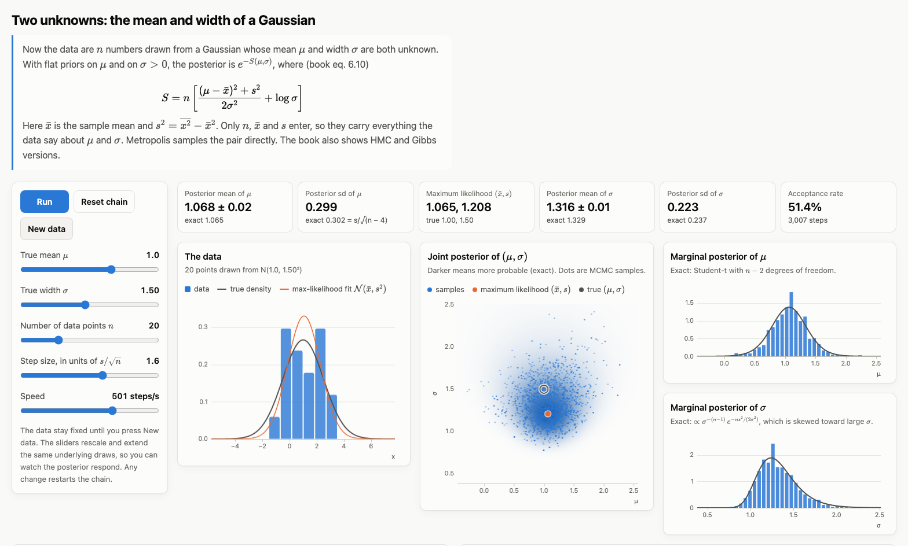
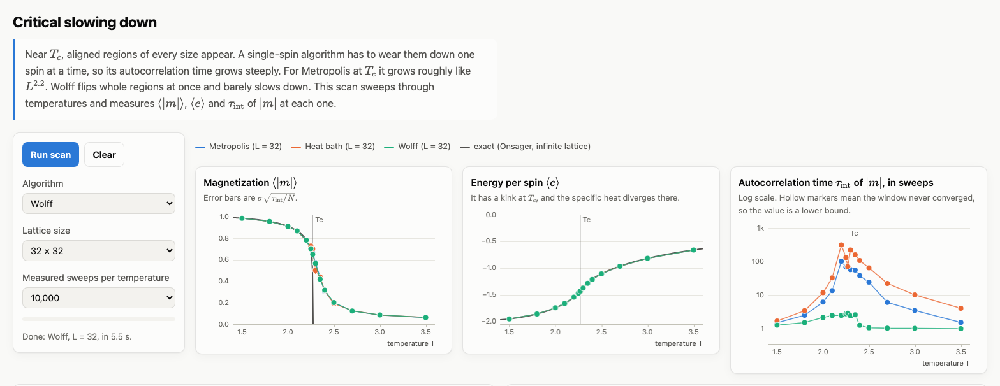
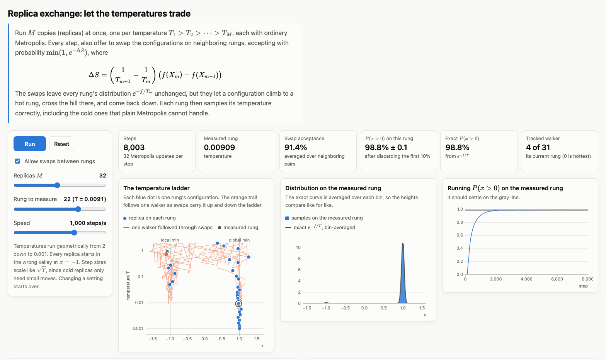
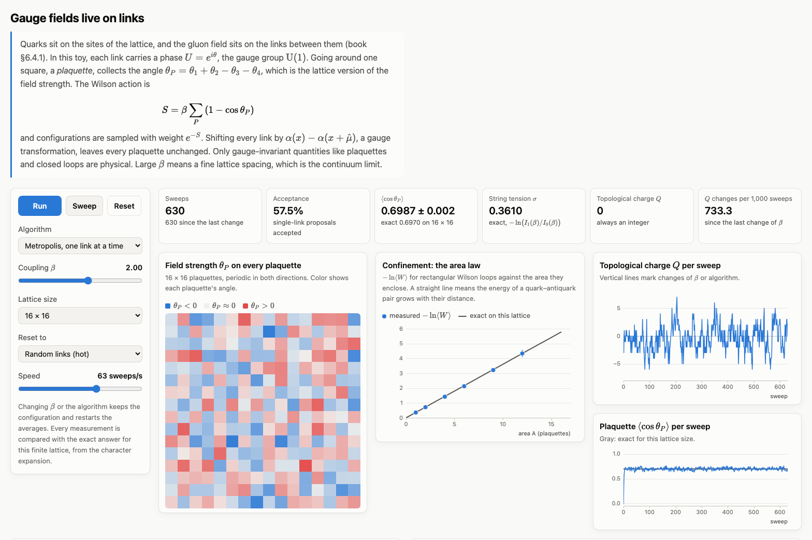

# MCMC Lab

An interactive web app for learning Markov chain Monte Carlo, built as a companion to
*MCMC from Scratch* by Masanori Hanada and So Matsuura (Springer, 2022). Every sampler is
written from scratch in plain JavaScript. There is no build step. The only third-party code is
[KaTeX](https://katex.org/), for typesetting equations, and it is bundled in `vendor/katex`, so
the app works offline.



## Run it

Browsers refuse to load JavaScript modules from `file://` URLs, so serve the folder locally:

```bash
python3 serve.py
```

Then open <http://127.0.0.1:8000/>. `serve.py` is a small wrapper around Python's built-in
server that turns off caching, so edits to the JavaScript show up on reload. Plain
`python3 -m http.server` works too, but it may serve stale modules while you edit.

To open a page with a lab already running, add `?run=` and the lab's id, or `?run=all`. For
example, `metropolis.html?run=lab` or `hmc-gibbs.html?run=rc-lab`.

## Modules

| Page | Book | What you can do |
|---|---|---|
| `monte-carlo.html` | ch. 2 | Estimate π with darts and watch the error fall like 1/√N. Compare uniform and importance sampling, including a proposal with infinite variance. |
| `metropolis.html` | ch. 3–4 | Step through accept/reject decisions on three targets. Read the trace, histogram, autocorrelation, τ_int, ESS and jackknife error bars. |
| `hmc-gibbs.html` | ch. 5 | Animate HMC leapfrog trajectories and their energy. Race Metropolis, Gibbs and HMC on a correlated Gaussian or a banana, with ESS per iteration and per unit of work. |
| `bayes.html` | §6.1 | Combine a prior with the likelihood of coin tosses and watch the posterior update. Sample it with Metropolis and check against the exact answer. Infer the mean and width of a Gaussian in 2D. |
| `ising.html` | §6.2 | Run the 2D Ising model with Metropolis, heat-bath or Wolff updates. Scan temperatures to measure ⟨\|m\|⟩, ⟨e⟩ and critical slowing down against Onsager's exact results. |
| `optimization.html` | §6.3 | Watch simulated annealing leave half its walkers in the wrong valley of the book's double well, then let replica exchange fix it. Solve the traveling salesman problem with replica exchange, against brute force and greedy descent. |
| `lattice.html` | §6.4 | The algorithms of lattice QCD on the 2D U(1) toy model: gauge fields on links, Wilson loops and the area law, topological freezing, and two quark flavors via pseudofermion HMC with a conjugate-gradient solver. |
| `tests.html` | — | Statistical and exact checks of every sampler (see below). |

Chart conventions used throughout: a gray line is the exact answer, blue/orange/aqua are
simulation output, and green ✓ / red ✗ mark accepted and rejected proposals. On wide screens
each lab's charts sit side by side, so a whole lab fits on a 1080p display. Narrower screens
stack them.

## A tour

**Metropolis.** Each proposal is shown with its accept/reject decision. The trace, histogram,
autocorrelation and jackknife charts then show how many independent samples the chain has
really produced.



**Metropolis vs Gibbs vs HMC.** Three samplers race on a Gaussian with correlation 0.95.
Effective sample size is reported per iteration and per unit of work.



**Bayesian inference.** The mean and width of a Gaussian are sampled jointly. The marginals are
checked against their closed forms, a Student-t for μ and a skewed density for σ.



**Critical slowing down.** A temperature scan of the Ising model. The autocorrelation time peaks
at T_c for single-spin updates, while Wolff cluster updates barely slow down.



**Replica exchange.** Every replica starts in the wrong valley. Swaps between temperatures carry
configurations over the hill, and the cold rungs converge to their exact equilibrium.



**Lattice gauge theory.** A U(1) gauge field on a 16 × 16 lattice. Wilson loops follow the area
law and the plaquette matches its exact value on the torus.



The screenshots are generated by `tools/capture_screenshots.py`, which drives headless Chrome at
1920 × 1080 with the app served locally.

## Layout

```
css/style.css          design tokens (light and dark) and layout
js/lib/random.js       seeded xoshiro128** generator, Box–Muller normals
js/lib/stats.js        FFT autocorrelation, τ_int with Sokal's window, ESS, jackknife, histograms
js/lib/plot.js         small canvas plotting layer with hover tooltips
js/lib/targets.js      target densities and their exact moments
js/lib/bayes.js        coin priors and posteriors on a grid, Gaussian (μ, σ) posterior, log Γ
js/lib/ui.js           header, theme toggle, sliders, animation loop, math typesetting
js/samplers/           metropolis.js, hmc.js, gibbs.js, ising.js, annealing.js, tsp.js,
                       gauge.js, schwinger.js (no DOM code)
js/pages/              one script per page
js/tests.js            the checks behind tests.html
vendor/katex/          KaTeX 0.18.9 (MIT): script, auto-render, CSS and WOFF2 fonts
docs/screenshots/      the images in this README
tools/                 capture_screenshots.py
```

The samplers do not touch the DOM, so they can be reused or tested on their own. Equations are
written in LaTeX inside the HTML, between `\( … \)` for inline math and `\[ … \]` for display
math, and typeset when the page loads.

## Checks

`tests.html` runs 50 checks in the browser: RNG moments, FFT autocorrelation against a direct
sum, τ_int of an AR(1) process against its exact value, sampler moments against exact
expectations (each within 4 of its own autocorrelation-aware error bars), leapfrog
reversibility and ε² energy scaling, Ising energy bookkeeping, Onsager's exact results,
agreement between the three Ising algorithms, Bayesian posteriors against closed forms and
brute-force integration, replica exchange against exact equilibrium and brute-force TSP optima,
and the lattice code against exact torus results. The Schwinger-model pseudofermion HMC is
checked against an independent exact-determinant simulation, and its quark force against
finite differences. The first run uses fixed seeds, and the button reruns with fresh ones.

One of those checks exists because of a bug it caught. An earlier Wolff "sweep" stopped as soon
as N spins had flipped. That stopping rule depends on the state (the cluster that crosses the line
tends to be large), and it biased ⟨e⟩ by about 9 error bars. A sweep is now a fixed number of
clusters, calibrated after each temperature change.

## Coverage

Every chapter of the book from 2 to 6. Section 6.4 (lattice QCD) runs on the two-dimensional U(1)
toy model, not full four-dimensional SU(3) QCD, using the same algorithms: HMC, pseudofermions
and conjugate gradient.

## License

MIT, see [LICENSE](LICENSE). The bundled KaTeX in `vendor/katex` is also MIT-licensed and keeps
its own license file. The book itself is not part of this repository.
